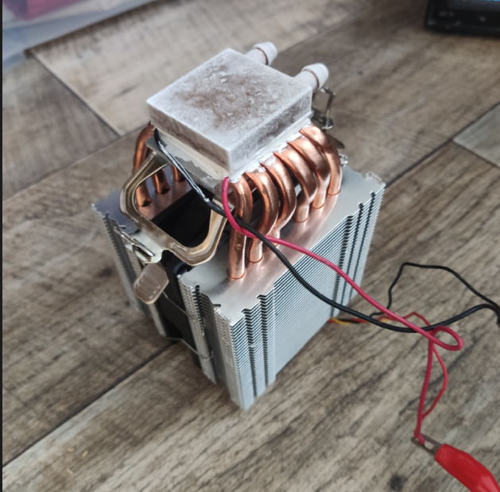
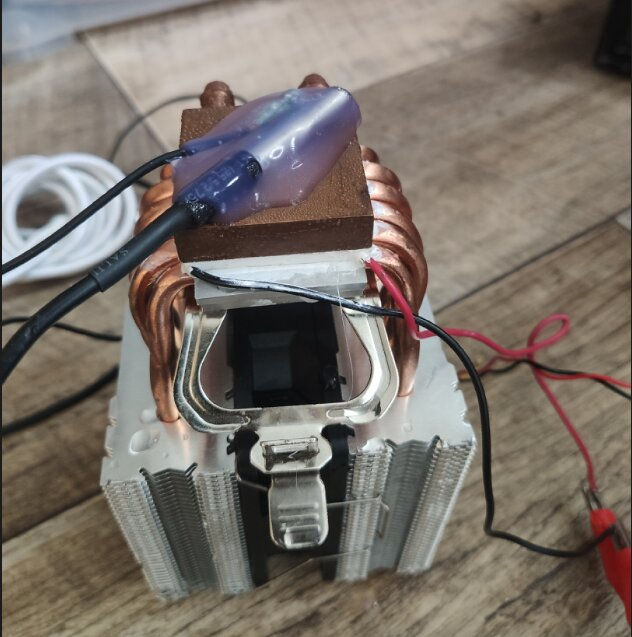
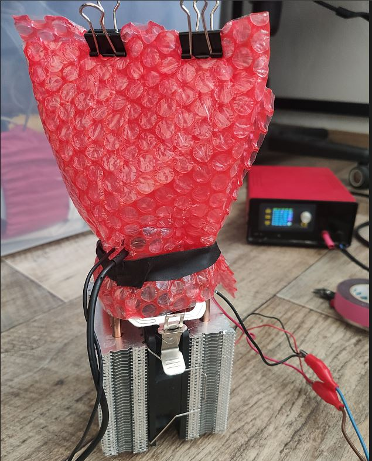
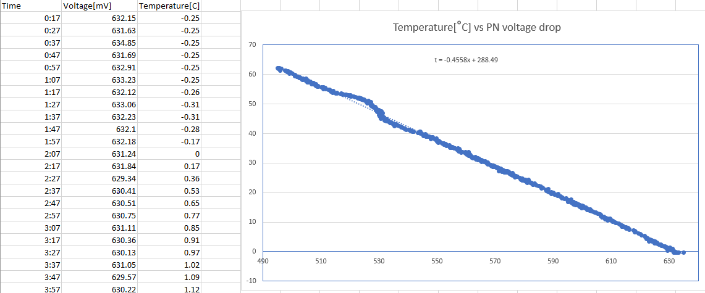

# A Transistor Instead of a Thermosensor? Sure!

This project demonstrates the feasibility of using a **BJT transistor (base-emitter junction)** instead of an NTC/PTC thermistor for temperature measurement using an MCU ADC.

## Overview

Instead of a traditional thermistor, this project uses the base-emitter junction of a silicon NPN transistor as a temperature-dependent diode. The forward voltage (V_BE) decreases approximately linearly with temperature (~2 mV/°C), enabling simple temperature sensing.

## Hardware Setup

- Seeeduino XIAO (SAMD21G18)
- BC849C NPN transistor (sensor)
- DS18B20+ digital temperature sensor (calibration reference)
- MCU ADC with internal 1.0 V reference

## Calibration Setup

### Initial setup (no sensors)

### Sensors glued

### Sensors insulated with bubble foil

## Measurement Result

## Principle

The base-emitter voltage of a BJT biased at constant current is measured and mapped to temperature using a linear approximation:

T(V) ≈ a · V + b

Where:
- V is the measured V_BE
- a, b are calibration constants

## Calibration Method

Calibration is performed using a DS18B20+ sensor as a reference while recording transistor voltage across a temperature range (0–60 °C). A linear fit is then applied.

## Goals

- Demonstrate low-cost temperature sensing using discrete components
- Compare performance against NTC thermistors
- Achieve ~±0.5 °C accuracy after calibration

## Notes

- BC849C selected for no particular reason :)
- Accuracy depends on current stability, thermal coupling, and ADC reference quality
